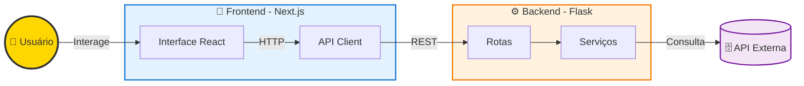
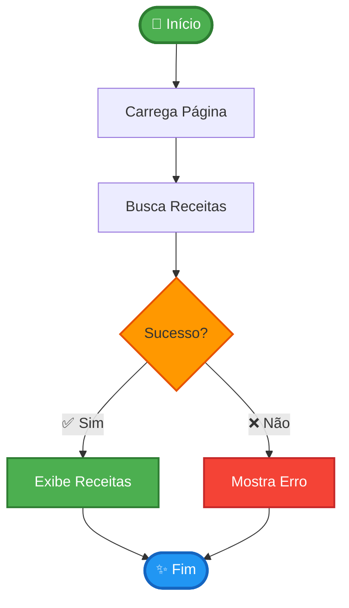
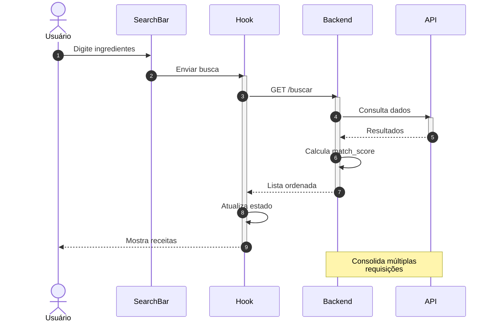
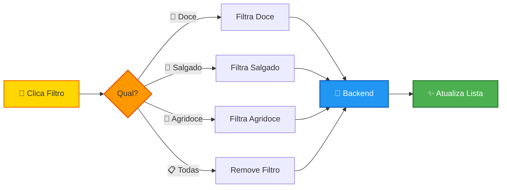
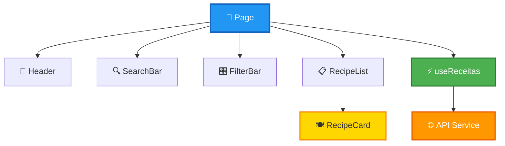
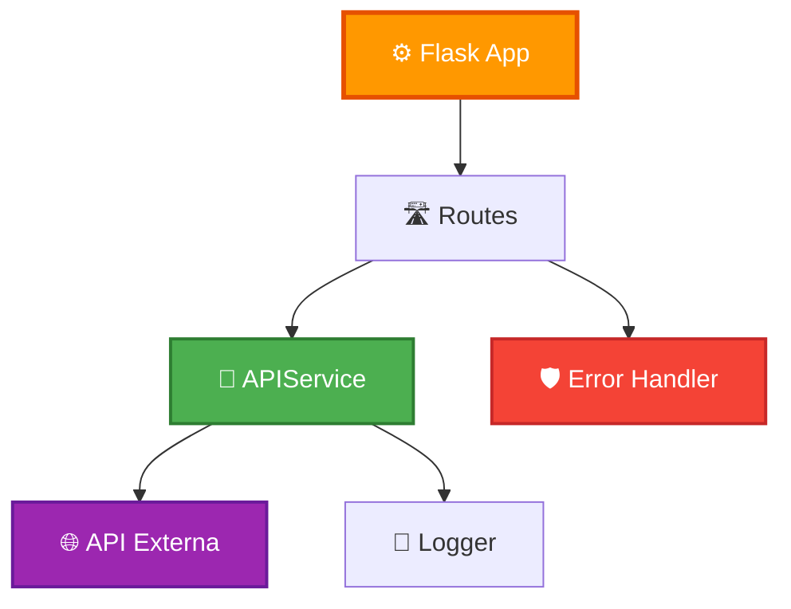
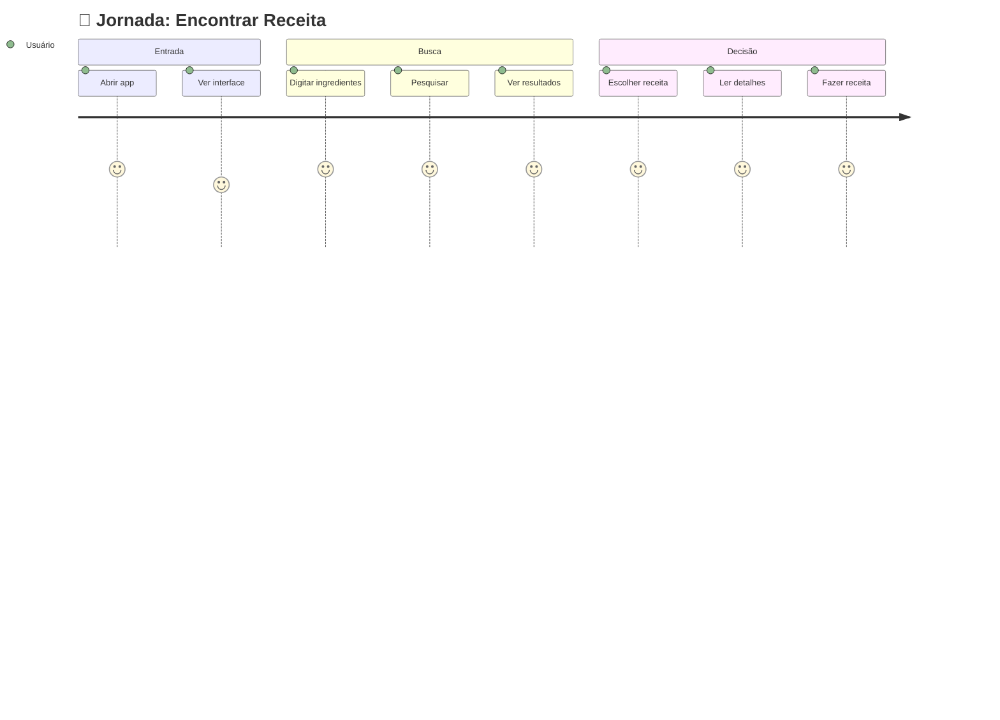
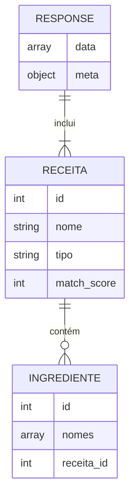
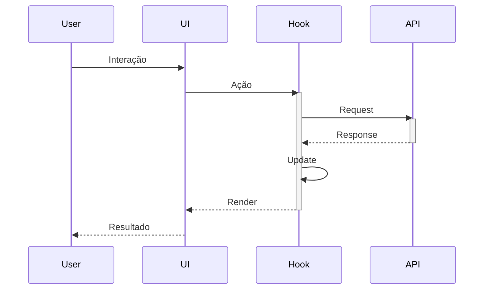

# 🍽️ OpenRecipes - Fullstack Application

Aplicação fullstack para busca e consulta de receitas culinárias baseada nos ingredientes disponíveis.


 

### Frontend
- **Next.js 15** (App Router)
- **React 19**
- **TypeScript**
- **Tailwind CSS**
- **Axios**
- **Lucide React** (ícones)

### Backend
- **Flask 3.0**
- **Python 3.11+**
- **Requests** (HTTP client)
- **Flask-CORS**

## 👥 Histórias de Usuário Implementadas

✅ **História 1**: Busca por Ingredientes  
✅ **História 2**: Visualização de Lista  
✅ **História 3**: Filtros por Tipo  
✅ **História 4**: Detalhes da Receita  
✅ **História 5**: Interface Responsiva  
✅ **História 6**: Busca Avançada 

## 📊 Diagramas (Mermaid)

<details>
<summary><b>🏗️ Arquitetura Geraal do Sistema</b></summary>



</details>

<details>
<summary><b>🔄 Fluxo Principal da Aplicação</b></summary>



</details>

<details>
<summary><b>🔍 Busca por Ingredientes</b></summary>



</details>

<details>
<summary><b>🎛️ Filtros por Tipo</b></summary>



</details>

<details>
<summary><b>🧩 Componentes Frontend</b></summary>



</details>

<details>
<summary><b>⚙️ Componentes Backend</b></summary>



</details>

<details>
<summary><b>🎯 Jornada do Usuário</b></summary>



</details>

<details>
<summary><b>📦 Estrutura de Dados</b></summary>



</details>

<details>
<summary><b>🔄 Comunicação Entre Camadas</b></summary>



</details>

## Wireframe
 

## 📚 Documentação Adicional
- [📄 Histórico de Conversas com o perplexity (DOCX)](docs/historico_perplexity.docx)

## 🔧 Melhorias Futuras

- [ ] Adicionar autenticação de usuários
- [ ] Sistema de favoritos
- [ ] Histórico de buscas
- [ ] Testes unitários e E2E
- [ ] CI/CD pipeline

## 📄 Licença

Este projeto foi desenvolvido para fins educacionais.

***

**Desenvolvido com ❤️ usando Next.js e Flask**
```